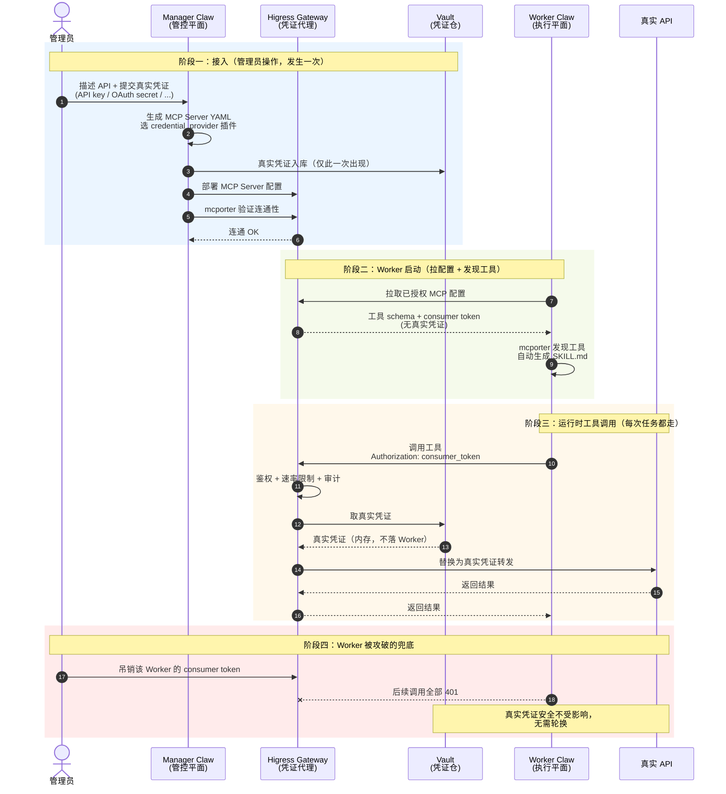

# MCP Server 管理方案

> 参考实现: [[raw/HiClaw 1.0.6：企业级 MCP Server 管理 — 凭证零暴露，工具全接入.md]]
> 行业参考: [[raw/Building agents that reach production systems with MCP.md]]（Anthropic Claude 团队）
> 更新日期: 2026-04-24

## 一句话定位
企业级 MCP Server 管理体系：通过  **HiClaw Manager- HiClaw Worker 双角色 + AI Gateway 凭证代理**，实现"工具全接入 + 真实凭证零暴露"——Worker 只拿可吊销的 consumer token，真实 API key / Bearer token / Service Token 永不进入 Worker 进程。

---

## 为什么选 MCP，而不是 Direct API 或 CLI

生产 Agent 接入外部系统通常有三条路径，各有适用边界（参考 Anthropic [[raw/Building agents that reach production systems with MCP.md]]）：

| 路径             | 做法                                         | 适用场景                       | 规模化问题                                                                                       |
| -------------- | ------------------------------------------ | -------------------------- | ------------------------------------------------------------------------------------------- |
| **Direct API** | Agent 在 sandbox 里直接发 HTTP                  | 单 Agent × 单服务的 POC、原型      | **M×N 集成灾难**：每对 Agent×服务都要重写 auth / 工具描述 / 边界处理，无法复用                                        |
| **CLI**        | Agent 在 shell 里跑命令行工具                      | 本地环境 / 沙箱容器（有文件系统 + shell） | 够不到移动端 / Web / 云端 Agent（容器不暴露 shell）；auth 靠 CLI 自己的凭证文件，安全模型很弱                              |
| **MCP**        | Agent 连到 MCP Server，协议层统一 auth / 发现 / 调用语义 | 云端 Agent 接入云端系统（绝大多数生产场景）  | 前期需要多投入一点（写 Server），但**一个远程 Server 可被任意兼容客户端复用**（Claude / ChatGPT / Cursor / VS Code / ...） |

**为什么生产 Agent 必然落到 MCP**：
- 生产 Agent 要能持续运行、弹性扩容，必然跑在云端；它要访问的系统（数据、工单、基础设施）也大多在云端、在 auth 后面
- MCP 把 **auth / 能力发现 / 调用语义**沉到协议层，避开 Direct API 的 M×N 爆炸
- Direct API 和 CLI 不会消失：成熟方案通常**三种都出**——API 是底座、CLI 给本地场景、MCP 给云端 Agent。但**复合增益**在 MCP 上：同一个 Server 随着更多客户端 / 协议扩展落地，自动获得新能力

> 本页后续讨论的"MCP Server 管理方案"默认围绕**远程 MCP Server**展开——这是唯一能覆盖 Web / 移动 / 云端 Agent 的形态。

---

## 核心设计决策（ADR）

- **决策**：MCP 采用 Manager-Worker 分离架构，凭证只存 Manager/Gateway 一侧，Worker 通过 Gateway 调用 MCP 工具
- **背景**：AI Agent 运行在不可信环境（容器可逃逸、Prompt 可注入、日志可被读取），任何进入 Worker 进程的真实凭证都有泄露风险。传统"把 API key 注入环境变量"做不到细粒度吊销和审计
- **后果**：新增 Gateway 层（增加一跳网络延迟 ~5ms），但获得"凭证漏一次只影响 Worker 级别""吊销 token 不需要轮换真实凭证"的安全收益

---

## 应用网关中MCP 与 Skill 的定位差异

MCP 和 Skill 不是替代关系，是**分层协同**：

| 层次 | 职责 | 粒度 | 演进速度 |
|---|---|---|---|
| **MCP 工具** | 原子能力：一个 API 端点 = 一个工具 | 细粒度（单一动作） | 慢（接口稳定） |
| **Skill** | 场景能力包：把多个工具编排成一个可复用的工作流 | 场景级 | 快（迭代频繁） |

```
MCP 工具（原子能力：call_api / read_db / send_message）
    ↓ Skill 编排
SKILL（场景能力包：crm-query / sales-report / ticket-routing）
    ↓ 实战使用与迭代
SKILL 自进化（用户纠正 / Agent 修补）
```

**边界**：
- **权限治理**交给 MCP 层（工具粒度 RBAC、凭证隔离、速率限制）
- **场景演进**交给 Skill 层（自由迭代、审核发布、沙箱评估）

---

## 架构链路

```
用户
  ↓
Manager Claw（管控平面）
  │ ① 管理员描述 API + 提交真实凭证
  │ ② 生成 MCP Server YAML 配置
  │ ③ 部署到 Gateway
  │ ④ 用 mcporter 验证连通性
  ↓
Higress AI Gateway（凭证代理层）
  │ 存真实凭证（Vault）
  │ 签发 consumer token 给 Worker
  │ 代理所有 MCP 调用，按 token 做权限校验
  │ 记录审计日志
  ↓
Worker Claw（执行平面）
  │ 拉取 MCP 配置（只含 consumer token + 工具 schema）
  │ mcporter 发现工具 → 自动生成 SKILL.md
  │ 调用工具时走 Gateway，看不到真实凭证
```

**关键数据流**：
- 真实凭证：User → Manager → Gateway（**Worker 永远看不到**）
- Consumer token：Gateway → Worker（可随时吊销，作用域限定）
- 工具调用：Worker → Gateway → 真实 API（Gateway 替换为真实凭证转发）

### 时序图

三个阶段串起来展示一次完整链路：**接入 → Worker 启动 → 工具调用 → 攻破吊销兜底**。



**图示要点**：
- **红线**（阶段一）真实凭证仅在 Admin → Manager → Vault 流转一次，之后**再不出现**在任何与 Worker 相关的通道
- **绿线**（阶段二）Worker 拿到的配置只含 `consumer_token + 工具 schema`，看不到任何真实凭证
- **黄线**（阶段三）每次调用时 Gateway 现场从 Vault 取凭证→替换转发→回收，真实凭证不落 Worker 进程
- **红线**（阶段四）吊销只针对 consumer token，真实 API key 无需同步轮换——这是"Manager-Worker 分离"最核心的运维收益

---

## 工具批量接入能力

### 从 Swagger/OpenAPI 导入

```
管理员：这是产品目录 API 的 Swagger：https://docs.internal/swagger.json
       通过 X-API-Key 认证，Key: prod_cat_xxx

Manager：
  - 解析 Swagger → 发现 12 个端点
  - 自动生成 12 个 MCP 工具定义
  - 部署到 Gateway，命名空间 product-catalog
  - 通知相关 Worker 拉取配置
```

### 从 curl 命令导入

```
管理员：curl -X GET "https://api.shipping.com/v1/track?tracking_id=ABC" -H "X-API-Key: ship_xxx"

Manager：
  - 解析 curl → 推断工具 schema（路径、参数、认证头）
  - 创建 MCP Server shipping，工具 track_package
  - Gateway 部署，凭证存 Vault
```

### 价值

传统方案需要工程师为每个 API 写 MCP 适配代码，批量接入成本高。Swagger/curl 直接导入让**运维人员自助接入 API**，Agent 几分钟内就能用上新工具。

---


## 凭证零暴露模型

### Worker 可以做的
- 调用所有已授权的 MCP 工具
- 通过 Gateway 使用工具（consumer token 鉴权）
- 基于工具调用经验生成 / 修改 SKILL.md
- 在授权范围内自主工作

### Worker 不能做的
- 读取任何真实凭证（环境变量 / 文件 / 内存里都没有）
- 调用未授权的 MCP Server
- 从 Gateway 反向提取凭证
- 跨 Worker 共享凭证

### Worker 被攻破的影响范围
1. 攻击者拿到的只是 consumer token（仅在本系统内有效）
2. Manager 立即吊销该 token，无需轮换任何真实凭证
3. 真实 API key 安全不受影响
4. 创建新 Worker，几分钟内恢复工作

---

## 优化：MCP Server 设计模式

Manager 帮管理员落地 MCP Server 时，应遵循下面这些经过 Anthropic 在 200+ Server 实践中验证的模式（参考 [[raw/Building agents that reach production systems with MCP.md]]）。

### 模式 1：远程优先（不做 stdio-only Server）
只有**远程 Server**才能被 Web / 移动 / 云端 Agent 使用，也是主流客户端优化消费的形态。中台的 MCP 管理默认只接收远程 Server 的接入申请；stdio-only 的开源 Server 需要先由 Manager 包一层 HTTP 网关才纳管。

### 模式 2：按 intent 分组，不是一对一映射 API
**反模式**：把一个 REST API 按端点 1:1 映射成 MCP 工具——Agent 要串多次调用才能完成一件事，Token 成本高、错误率高。

**正确做法**：按**用户意图**设计工具，一个工具完成一个可用任务：
```
❌  get_thread + parse_messages + create_issue + link_attachment
✅  create_issue_from_thread
```

这条规则决定了 Manager 从 Swagger 导入时**不能机械翻译**——需要 LLM 辅助识别"常用意图链"，合并成语义化工具。12 个 Swagger 端点生成 12 个工具可以作为起点，但上线前要经过意图合并优化。

### 模式 3：大工具面用 code orchestration
当服务本身有几百到几千个操作（AWS / Cloudflare / Kubernetes 级别），intent 分组也覆盖不过来。这时换一种"薄工具面 + 代码执行"的模式：

```
Server 只暴露 2 个工具：
  - search（检索 API 端点 schema）
  - execute（在沙箱跑一段脚本调 API）

Agent 写几行 TypeScript/Python，Server 在沙箱执行，只把结果回传
```

Cloudflare 官方 MCP Server 就是这么做的——**2 个工具覆盖 ~2500 个端点，工具定义只花 ~1K tokens**。

中台意义：Manager 为超大 API（内部 OpenAPI 站点几百个端点那种）接入时，应自动走这条路径，避免把 Agent 的 context 塞满工具定义。

### 模式 4：富语义能力（MCP Apps + Elicitation）
MCP 不只是"调 API 回文本"，协议扩展已经支持在工具调用里返回**可交互 UI**、或**中途向用户索要输入**。这两个能力在 Claude.ai / Claude Code / Claude Cowork 等主流客户端都已支持，企业版应考虑启用：

| 能力 | 作用 | 典型用例 |
|---|---|---|
| **MCP Apps** | 工具返回结果可以是图表 / 表单 / 仪表板（在对话里原地渲染） | 调完"查订单"工具，直接在聊天里显示交互式订单详情卡片，而不是一堆 JSON 文本 |
| **Elicitation - Form mode** | Server 中途暂停，客户端弹原生表单收集用户输入 | 删除操作前弹确认对话框；必填参数缺失时弹表单让用户补齐，而不是让 Agent 瞎猜 |
| **Elicitation - URL mode** | Server 把用户丢到浏览器完成某个流程 | OAuth 授权、支付、任何**不应该过 MCP 客户端**的敏感凭证收集 |

**中台采纳建议**：
- 内部生产类 Server（查询 / 操作 CRM / ERP / 工单）优先接入 MCP Apps，把原有业务系统的 UI 复用到对话里
- 任何"需要人类确认"的动作（删除、付款、权限变更）走 Elicitation Form mode
- OAuth 新增授权走 Elicitation URL mode，**真实凭证不经过 Worker 侧的 MCP 客户端**（和本页"凭证零暴露"主线对齐）
- ---

## 动态凭证支持

静态 API key 只是最简单的情形。生产环境大量 API 使用**动态凭证**——需要运行时获取、按 TTL 刷新、按请求签名。这类场景下 Gateway 的角色从"代理静态凭证"升级为 **凭证获取与生命周期管理器**，Worker 依然完全无感。

### 典型动态凭证类型

| 场景 | 管理员配置（根凭证） | Gateway 运行时行为 |
|---|---|---|
| **OAuth2 client_credentials**（服务间） | `client_id` + `client_secret` + token endpoint | 首次调用换 access_token，按 `expires_in` 缓存，过期前 60s 主动刷新 |
| **OAuth2 authorization_code**（用户级，如 GitHub / Google） | `client_id` + `client_secret` + redirect_uri | 用户首次使用走浏览器授权流，refresh_token 按 user_id 存 Vault；调用前换 access_token |
| **AWS STS / AssumeRole** | base IAM 凭证 + `role_arn` + `external_id` | 每次调用（或 15 分钟缓存）前 AssumeRole，用临时凭证签名转发 |
| **AWS SigV4** | `access_key` + `secret_key` | 每次转发按请求路径 / headers / body 计算签名，加到 Authorization 头 |
| **JWT 服务账号**（GCP / 企业内部） | signing key（RSA 私钥）+ 声明模板 | 按 TTL 缓存签发的 JWT，过期前重签 |
| **Session-based login** | 用户名/密码 或 登录凭证 | 维护 session pool，cookie 过期或 401 时重登录 |
| **mTLS**（客户端证书） | 客户端证书 + 私钥 | 转发时用证书建立 TLS 通道，Worker 无感知 |

### 统一抽象：credential_provider 插件

MCP Server YAML 里声明认证类型，Gateway 加载对应的 provider 插件：

```yaml
mcp_server: billing
endpoint: https://billing.internal.company.com
auth:
  type: oauth2_client_credentials
  provider_config:
    token_url: https://auth.internal.company.com/oauth/token
    client_id_ref: vault://oauth/billing/client_id
    client_secret_ref: vault://oauth/billing/client_secret
    scope: "billing:read billing:write"
  cache:
    refresh_before_expiry_sec: 60
```

Provider 统一接口：

```python
class CredentialProvider:
    def get_credential(self, request_context) -> dict:
        """返回当前该请求的认证 headers / params"""

    def on_auth_failure(self, response) -> bool:
        """401/403 时是否重试（刷新凭证后重试一次）"""
```

已知插件库：`static_api_key` / `oauth2_cc` / `oauth2_ac` / `aws_sts` / `aws_sigv4` / `jwt_service_account` / `session_login` / `mtls`。

### Swagger 导入的扩展流程

```
管理员：Swagger URL + 认证配置
Manager：
  ① 解析 Swagger 的 securitySchemes 块（OpenAPI 标准字段）
     - securitySchemes.oauth2   → auth_type=oauth2
     - securitySchemes.http     → bearer → auth_type=static_bearer
     - securitySchemes.apiKey   → auth_type=static_api_key
  ② 根据 auth_type 选对应 credential_provider 插件
  ③ 动态凭证：让管理员补充根凭证（OAuth client_secret / STS base key / JWT signing key 等）
  ④ 部署到 Gateway，provider 插件启动
```

### 关键设计要点

1. **根凭证 vs 运行时凭证**：OAuth 的 `client_secret`、STS 的 IAM base key 是"根凭证"——配置一次、长期有效、存 Vault；换出来的短期 token 在 Gateway 内存里，不落盘
2. **缓存粒度**：服务级凭证（client_credentials）按 `mcp_server` 缓存；用户级凭证（authorization_code）按 `mcp_server + user_id` 缓存
3. **失败重试**：遇 401/403 时 provider 自动 refresh 一次再重试，第二次仍失败才返回错误给 Worker
4. **审计**：每次凭证获取 / 刷新 / 失败都写审计日志，追踪"谁代表谁调用了什么"
5. **对 Worker 完全透明**：Worker 始终只写 `mcporter.call("billing.get_customer", ...)`，不关心下面是静态 key、OAuth token、还是每次现算的 STS 临时凭证

### 行业对照：CIMD + Claude Managed Agents Vaults

Anthropic 在 [[raw/Building agents that reach production systems with MCP.md]] 里描述了与本页 Gateway 同构的行业方案，可作为中台设计的**背书和对齐参考**：

| 能力 | MCP 协议 / Anthropic 平台 | 中台 Higress Gateway 对位实现 |
|---|---|---|
| **OAuth 客户端注册** | [CIMD](https://modelcontextprotocol.io/specification/2025-11-25/basic/authorization#client-id-metadata-documents)（Client ID Metadata Documents）：首次 auth 更快，re-auth 提示少 | Manager 在部署 MCP Server 时一次性登记 OAuth Client 元数据，用户首次走浏览器授权，之后长驻 |
| **OAuth token 托管** | [Claude Managed Agents Vaults](https://platform.claude.com/docs/en/managed-agents/vaults#mcp-oauth-credential)：注册一次、session 级注入、平台自动刷新 | Higress Vault 存 refresh_token，Gateway 按需换 access_token 注入，过期前自动刷新 |
| **结果** | Agent 不持有任何 token | Worker 不持有任何 token |

结论：**MCP 生态已在往"凭证托管"方向收敛**，HiClaw 的 Gateway 代理 = CIMD + Vaults 的开源自建版，方向一致，不需要另辟蹊径。

---


## Worker 自生成 SKILL.md(待优化，如果后续更新呢)

首次调用新 MCP Server 时，Worker 自动执行：

```
1. mcporter list {server} --schema    → 发现所有工具及参数
2. mcporter call {server}.{tool}      → 测试代表性工具
3. 基于调用结果生成 SKILL.md：
   - 自然语言说明（LLM 总结工具用途）
   - 典型调用示例
   - 参数说明 + 陷阱
   - 错误处理注意事项
4. 写入个人 Skill 空间（skills/{tenant_id}/personal/{user_id}/）
```

后续调用该工具时，走 Skill 路径而非裸调 MCP，享受 Skill 的所有治理能力（条件激活、配额、降级等）。

---

## Client 侧的上下文优化

上面讨论的都是 Server 侧（Gateway / Manager / 工具设计）。Client 侧（Worker / Agent Loop）同样有显著的 Token 优化空间，参考 Anthropic 在 [advanced tool use](https://www.anthropic.com/engineering/advanced-tool-use) 里总结的两个模式：

### Tool Search：工具定义按需加载
**问题**：Worker 启动时把所有已授权 MCP 工具的完整 schema 灌进 context，几十个工具就能吃掉十几 K tokens，大部分根本用不上。

**做法**：[Tool Search](https://platform.claude.com/docs/en/agents-and-tools/tool-use/tool-search-tool) 把工具目录做成**可检索索引**，Agent 先看目录（几百 tokens），真用到时再按需把对应工具的完整 schema 拉进来。

**实测收益**：工具定义 Token 消耗**降低 85%+**，选择准确率不下降。

**中台落地**：
- Worker 启动时不全量加载 Gateway 里所有 MCP 工具
- 维护一个"工具目录索引"（每个工具只占一行摘要）
- Agent 调用 `search_tools(keyword)` → 返回 top-k 工具 schema → 再发起实际调用
- 与 Skill 管理的**渐进加载**思路一致（参见 [[skills/skill-manage.md]]）

### Programmatic Tool Calling：工具结果在代码沙箱里处理
**问题**：工具调用的原始结果（几百行 JSON、CSV 片段）塞进 context，既贵又让 Agent 难以聚焦关键信息。

**做法**：[Programmatic Tool Calling](https://www.anthropic.com/engineering/code-execution-with-mcp) 让 Agent 写一小段代码在沙箱里**循环 / 过滤 / 聚合**多次工具调用的结果，只把最终结论返回给 context。

**实测收益**：复杂多步工作流 Token 消耗**降低 ~37%**。

**中台落地**：
- Worker 侧 mcporter 支持"script 模式"：Agent 写 TS/Python 脚本，内部可以多次调 `mcp.call(...)` 并处理结果
- 沙箱仅暴露白名单 API（对齐 [[security/agent-security.md]] 的沙箱规范）
- 与本页"大工具面 code orchestration"模式同源——**Server 侧和 Client 侧都在往"用代码处理中间结果，只让结论进 context"演进**

### 两个模式组合
Tool Search 解决"**工具定义**吃 context"，Programmatic Tool Calling 解决"**工具结果**吃 context"。两者可叠加，构成 Worker 的双层上下文优化：

```
Worker 启动  → 只加载工具索引（轻量）
Agent 任务   → tool_search 按需加载 3-5 个相关工具
工具调用     → 在 sandbox 里跑脚本，原始结果不进 context，只回写结论
```

---

## 与中台 Skill 管理的协同

- **凭证管理**：[[skills/skill-manage.md]] #10 API Key / 凭证管理 的企业级实现，替代 `~/.hermes/.env` 的本地文件模式
- **自生成 Skill**：Worker 首次探索新 MCP → 生成 Skill 草稿 → 走 #15 Agent 提议审核流程
- **工具条件激活**：MCP 工具的 `requires_toolsets` 可直接对应 Gateway 配置的 MCP Server 列表

### 打包形态：Plugin 统一分发 Skill + MCP Server
Anthropic 在 [Plugins](https://code.claude.com/docs/en/plugins-reference#plugin-components-reference) 里把 **Skill + MCP Server + hooks + 子 Agent** 打成一个可分发单元。典型案例是 Cowork 的 data plugin：**10 个 Skill + 8 个 MCP Server**（Snowflake / Databricks / BigQuery / Hex 等）一起分发，用户一次安装就能获得"数据分析专家"能力。

中台对应设计：
- 把中台的 **Skill 包 + MCP Server 配置**按场景打成一个 bundle（如 "客服场景 bundle" = 客服 Skill 10 个 + CRM/工单/知识库 MCP Server 3 个）
- 组织 / 租户订阅 bundle 即获得完整场景能力，而不是单独挑工具
- 配合 [[skills/skill-manage.md]] 的组织树继承 + 6 级信任 Hub，bundle 是自然的分发粒度

### 新兴方向：从 MCP Server 分发 Skill
MCP 社区在做一个 [experimental-ext-skills](https://github.com/modelcontextprotocol/experimental-ext-skills) 扩展——MCP Server 可以**直接带着 Skill 一起发给客户端**，相当于 Server 厂商内嵌"用法指引"。Canva / Notion / Sentry 等已经在 Claude 连接器里这么做。

对中台的启示：
- 未来接入第三方 MCP Server 时，自动抓取其附带的 Skill，走审核流程后纳入中台 Skill Hub
- 中台自产 MCP Server（业务系统转的那些）也应附带 Skill 模板，让跨租户复用时不用从零生成 SKILL.md

---

## 上下游依赖

- 上游: [[architecture/gateway.md]] Worker 由网关路由触发
- 下游: [[skills/skill-manage.md]] Skill 编排 MCP 工具为场景能力
- 安全: [[security/agent-security.md]] 凭证隔离 + Worker 攻破兜底
