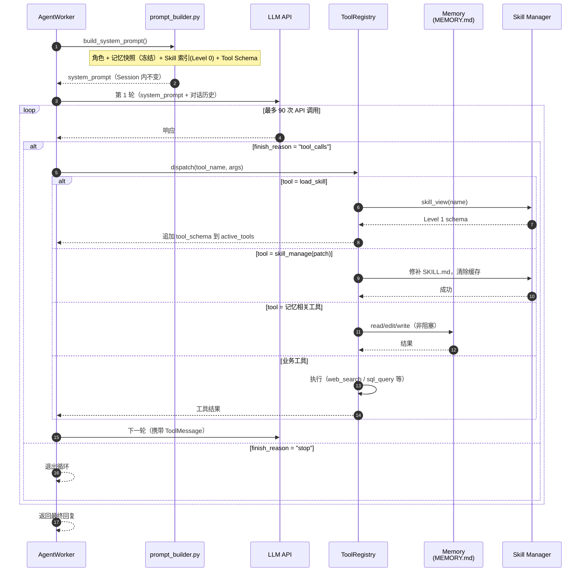
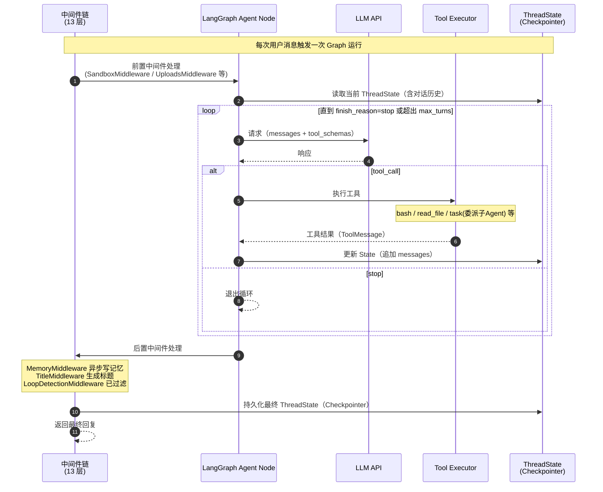

# Agent 执行循环时序

> 涉及组件: [[architecture/hermes.md]] / [[architecture/deerflow-agent.md]] / [[memory/memory-management.md]]
> 更新日期: 2026-04-21

## 概述

Agent 执行循环（Agent Loop）是 Agent 与 LLM 之间的核心交互模式：LLM 返回工具调用则执行工具并将结果喂回，返回纯文本则退出。Hermes 和 DeerFlow 在实现方式上有显著差异。

---

## 一、Hermes Agent Loop

**关键参数**：最多 90 次 API 调用；每轮携带全量工具 schema（不像 DeerFlow 有 Deferred Tool）；记忆更新是主线程内的同步工具调用（但 Agent 通常不阻塞等结果）。

---

## 二、DeerFlow Agent Loop（LangGraph 版）

**关键参数**：无硬性轮次上限（由中间件 LoopDetectionMiddleware 检测重复调用退出）；SummarizationMiddleware 在接近 token 限制时自动压缩；MemoryMiddleware 异步写记忆不阻塞主流程。

---

## 三、两种 Loop 设计对比

| 维度 | Hermes | DeerFlow |
|---|---|---|
| 实现方式 | 自定义 `run_conversation()` 循环 | LangGraph StateGraph |
| 最大轮次 | 硬限制 90 次 API 调用 | 无硬限制，LoopDetection 软检测 |
| 状态管理 | 对话历史存内存，Session 结束写文件 | LangGraph Checkpointer 持久化 |
| 上下文压缩 | `context_compressor.py` 滑动窗口 | SummarizationMiddleware 按需压缩 |
| 工具调度 | `ToolRegistry.dispatch()`，同步阻塞 | LangGraph Tool Node，支持并发 |
| 记忆更新 | Agent 主动调工具写文件（inline） | MemoryMiddleware 异步队列（解耦） |
| Skill 加载 | `load_skill` meta-tool 动态追加 schema | `read_file` 读 SKILL.md 文本 |
| 断点恢复 | 不支持 | ✅ Checkpointer 支持跨 Session 恢复 |
