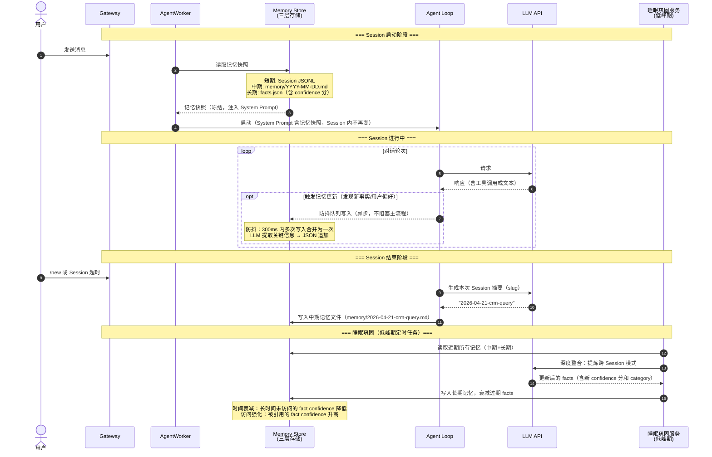
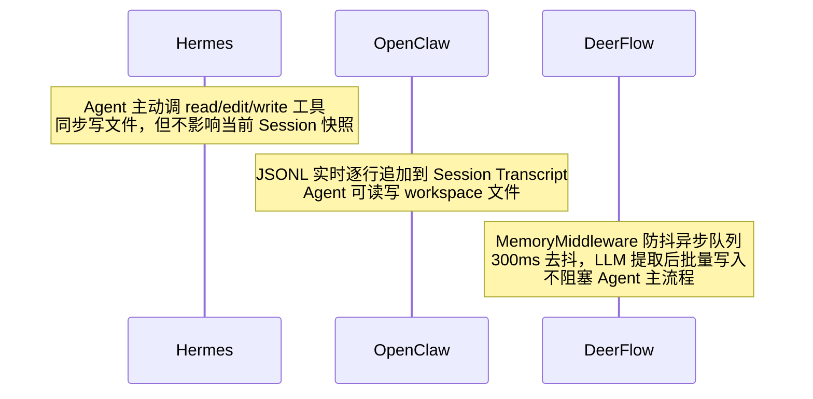

# 记忆生命周期时序

> 涉及组件: [[memory/memory-management.md]] / [[memory/hermes-memory.md]] / [[memory/deerflow-memory.md]]
> 更新日期: 2026-04-21

## 概述

记忆生命周期涵盖三个阶段：Session 启动时从持久化存储读取记忆注入上下文、Session 进行中异步更新记忆、Session 结束时巩固提炼长期记忆。不同框架在各阶段的实现差异显著。

---

## 一、中台记忆全生命周期



---

## 二、各框架记忆阶段对比

### Session 启动（注入阶段）

| 框架 | 注入方式 | 特点 |
|---|---|---|
| Hermes | 冻结快照 | Session 开始时固定，中途不更新，保 Prompt Cache 命中率 |
| OpenClaw | 每次启动注入 workspace 文件 | MEMORY.md 仅 main session 注入，群聊不注入（安全隔离） |
| DeerFlow | `format_memory_for_injection()` 写入 System Prompt | 含 facts 数组（confidence + category） |

### Session 进行中（更新阶段）



### Session 结束（巩固阶段）

| 框架 | 触发时机 | 处理方式 |
|---|---|---|
| Hermes | 无自动巩固（靠字符上限控制） | Agent 随时可写，2200 字符上限 |
| OpenClaw | `/new` 或 `/reset` 命令 | LLM 生成 slug → 保存为 `memory/YYYY-MM-DD-{slug}.md` |
| DeerFlow | 对话结束后 + 低峰期巩固 | 防抖队列 flush + 睡眠巩固（跨 Session 模式提炼） |

---

## 三、中台设计的记忆衰减机制

```
facts.json 中每条记忆的生命周期：

新建 (confidence=0.7)
    ↓ 时间流逝（无访问）
    ↓ 每天衰减 δ（衰减率可配置）
过期 (confidence < 阈值，如 0.2)
    ↓ 睡眠巩固时评估是否删除

被访问/引用
    ↑ confidence += 强化增量
    ↑ 最高上限 1.0

跨 Session 多次出现的模式
    ↑ 提炼为更高 confidence 的长期记忆
```

衰减公式参考：`confidence_t = confidence_0 * (1 - decay_rate)^days_since_last_access`

---

## 关键注意点

- **冻结快照 vs 实时更新**：Hermes 的冻结设计保证了 Prompt Cache 稳定（同一 Session 内 system_prompt 不变），但代价是本 Session 新增记忆要下次才生效。
- **防抖队列的必要性**：DeerFlow 的防抖设计防止高频对话导致大量 LLM 记忆提取调用，显著降低成本。
- **睡眠巩固时机**：选在系统低峰期（如凌晨 2-4 点），避免影响在线服务性能。
- **长期记忆上限**：Hermes 用字符上限（2200 字符）粗控，中台应用 confidence 分 + 显式删除策略精控。
