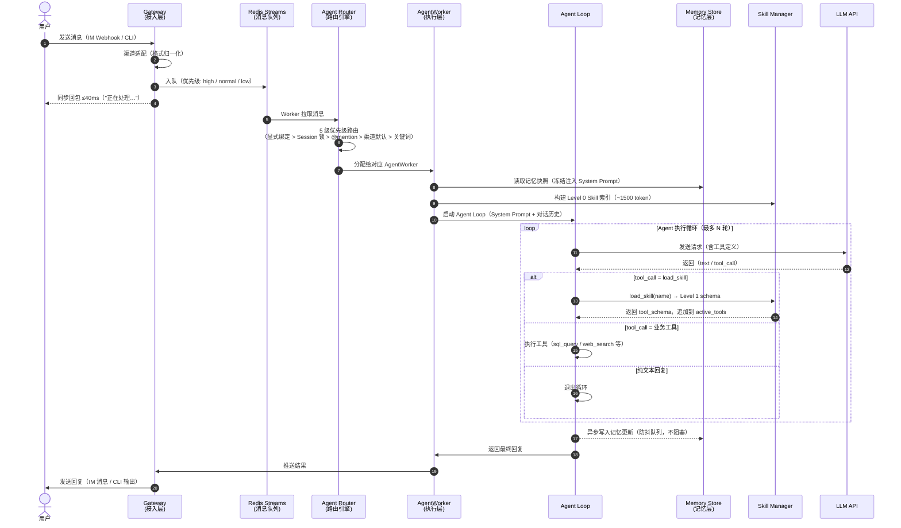

# 消息全链路时序

> 涉及组件: [[architecture/gateway.md]] / [[architecture/agent-router.md]] / [[architecture/hermes.md]] / [[memory/memory-management.md]] / [[skills/skill-iteration.md]]
> 更新日期: 2026-04-21

## 概述

描述一条用户消息从进入系统到返回响应的完整路径，覆盖接入层、路由层、执行层三个阶段。是整个系统的骨架时序图，其他流程（Skill 加载、记忆读写、多 Agent 协调）都是从这条主链上分支出去的子流程。

## 时序图

## 关键节点说明

| 节点 | 设计要点 | 参考 |
|---|---|---|
| Gateway 同步回包 | ≤40ms，满足 IM 平台要求；Agent 执行完全异步 | [[architecture/gateway.md]] |
| Redis Streams 入队 | 三级优先级；消费者组保证 at-least-once 投递 | [[architecture/gateway.md]] |
| 5 级路由 | 显式绑定 > Session 锁 > @mention > 渠道默认 > 关键词匹配 | [[architecture/agent-router.md]] |
| 记忆冻结快照 | Session 开始时固定，中途不更新，保证 Prompt Cache 命中率 | [[memory/memory-management.md]] |
| Level 0 Skill 索引 | 只注入名称+描述，~1500 token（全量注入约 9000 token） | [[skills/skill-iteration.md]] |
| 记忆异步写入 | 防抖队列批量 LLM 提取，不阻塞关键路径 | [[memory/memory-management.md]] |

## 异常路径

| 异常场景 | 处理方式 |
|---|---|
| LLM API 超时 | Worker 指数退避重试，超上限返回降级提示给用户 |
| 工具执行失败 | Agent 捕获错误，尝试替代路径或向用户说明原因 |
| Agent 超出最大轮次 | 强制退出循环，返回当前最佳结果并附说明 |
| 记忆写入失败 | 静默降级，不影响本次回复，下次 Session 记忆不更新 |
| 队列积压 | Worker 集群横向扩容（Redis Streams 消费者组支持） |

## 子流程索引

从本流程分支出去的详细时序图（待建）：

- `flows/skill-loading.md` — Skill 渐进加载（Level 0 → load_skill → Level 1 → Level 2）
- `flows/memory-lifecycle.md` — 记忆生命周期（Session 启动注入 → 对话中更新 → Session 结束巩固）
- `flows/multi-agent.md` — 多 Agent 协调（Lead Agent 委派 → 子 Agent 并发 → 结果汇总）
- `flows/agent-loop.md` — Agent 执行循环内部细节
