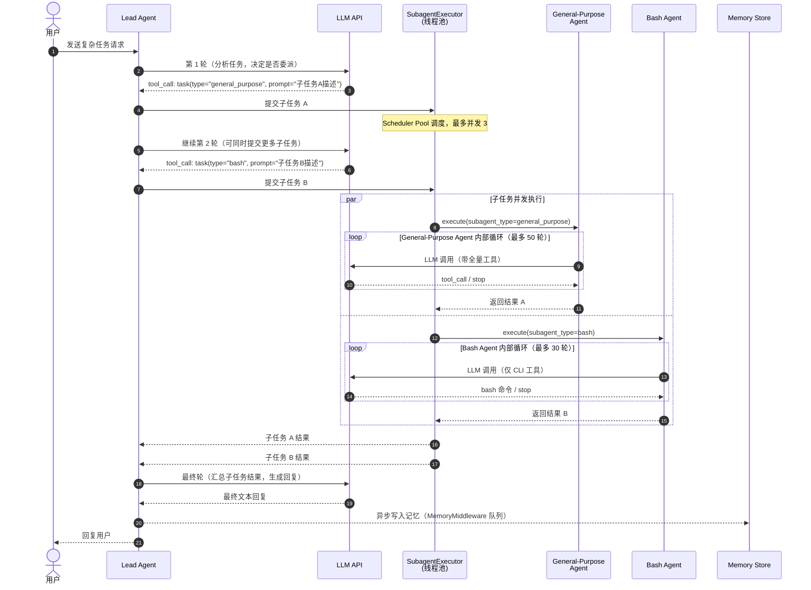

# 多 Agent 协调时序

> 涉及组件: [[architecture/deerflow-agent.md]] / [[architecture/deerflow.md]] / [[architecture/agent-router.md]]
> 更新日期: 2026-04-21

## 概述

DeerFlow 的多 Agent 协调模式：Lead Agent 处理用户请求，判断是否需要子任务并发执行，通过 `task` 工具委派给 SubagentExecutor，子 Agent 在独立线程中并发运行（最多 3 个），结果返回给 Lead Agent 汇总后回复用户。

---

## 时序图

---

## 关键设计点

| 设计点 | 说明 |
|---|---|
| 最大并发 3 | `MAX_CONCURRENT = 3`，Scheduler Pool 和 Execution Pool 各 3，防止过载 |
| 禁止嵌套委派 | 子 Agent 不能再调 `task` 工具，防止无限递归 |
| 共享沙箱 | 所有子 Agent 共享父 Agent 的 `sandbox_id` 和 `thread_id`，文件访问不隔离 |
| 超时保护 | 子 Agent 超时默认 900s，可在 `config.yaml` 覆盖 |
| 工具继承 | General-Purpose Agent 继承父 Agent 全量工具；Bash Agent 只有 CLI 工具 |

---

## 异常路径

| 异常场景 | 处理方式 |
|---|---|
| 子 Agent 超时（>900s） | 强制终止，SubagentExecutor 返回超时错误给 Lead Agent |
| 子 Agent 超出最大轮次 | 退出循环，返回当前最佳结果 |
| 并发达到上限（已有 3 个在跑） | SubagentLimitMiddleware 拦截新的 `task` 调用，告知 Lead Agent 等待 |
| 子 Agent 执行报错 | 错误信息作为结果返回，Lead Agent 决定是否重试或降级处理 |

---

## 与 OpenClaw 路由模式的对比

| 维度 | DeerFlow 多 Agent | OpenClaw 路由分发 |
|---|---|---|
| 协调模式 | Lead Agent 动态决策委派 | 路由引擎静态规则分发 |
| 并发支持 | 线程池并发（最多 3） | Worker 集群横向扩展 |
| 任务粒度 | 同一请求内的子任务 | 独立的用户请求 |
| 状态共享 | 共享 sandbox/thread_data | Session 隔离，不共享 |
| 适用场景 | 复杂推理任务分解 | 多渠道多 Agent 企业部署 |
