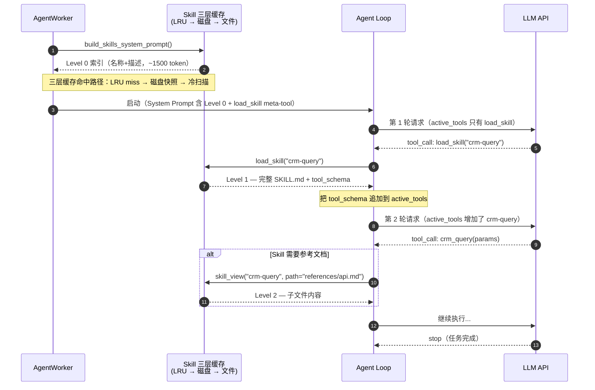
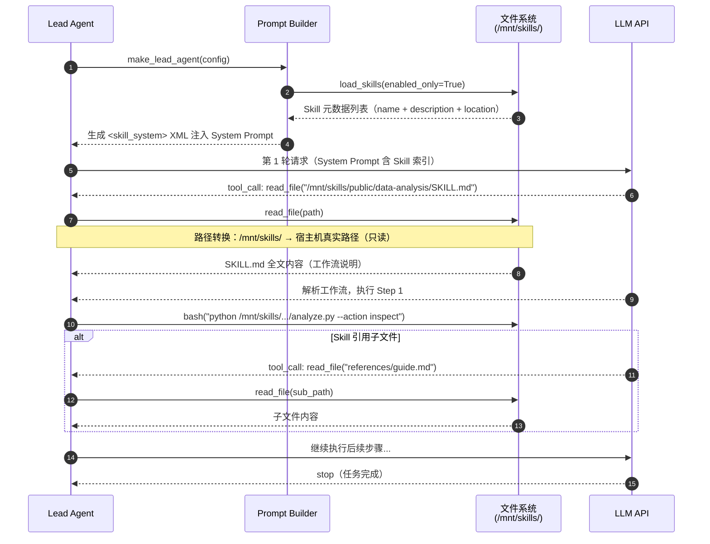

# Skill 渐进式加载时序

> 涉及组件: [[skills/skill-iteration.md]] / [[skills/hermes-skills.md]] / [[architecture/deerflow-agent.md]]
> 更新日期: 2026-04-21

## 概述

Hermes 和 DeerFlow 都实现了渐进式 Skill 加载，但机制不同：Hermes 通过 `load_skill` meta-tool 按需注入 tool_schema；DeerFlow 通过 `read_file` 读取 SKILL.md 文件内容。两者的共同目标都是让系统提示只含索引（~1500 token），用的时候才加载全量内容（节省 80%+ token）。

---

## 一、Hermes Skill 加载时序

### 关键设计点

| 层级 | 内容 | Token 消耗 |
|---|---|---|
| Level 0（索引） | 所有 Skill 名称 + 描述 | ~1500 token |
| Level 1（schema） | 单个 Skill 的完整 SKILL.md + tool_schema | ~300-800 token/个 |
| Level 2（子文件） | references/ templates/ scripts/ 内的文件 | 按需 |

- 已加载的 Skill 在后续所有轮次继续可用（追加到 `active_tools`，不重复加载）
- 三层缓存失效：`skill_manage` 操作后主动 `clear()`，下次请求走冷扫描重建

---

## 二、DeerFlow Skill 加载时序

---

## 三、Hermes vs DeerFlow 对比

| 维度 | Hermes | DeerFlow |
|---|---|---|
| 索引注入 | 系统提示文本（`<available_skills>`） | 系统提示 XML（含文件路径） |
| 触发工具 | `load_skill(name)` meta-tool | `read_file(path)` 通用工具 |
| 加载内容 | tool_schema（注册为可调用工具） | SKILL.md 文本（LLM 按文本执行） |
| 缓存 | 三层缓存（LRU + 磁盘快照 + 冷扫描） | 无缓存（每次 make_lead_agent 重加载） |
| 安全 | 创建/安装/view 三次安全扫描 | 安装时验证路径/名称；/mnt/skills/ 只读 |
| token 节省 | Level 0 ~1500 vs 全量 ~9000（节省 80%+） | 类似（只注入描述+路径，不含正文） |
